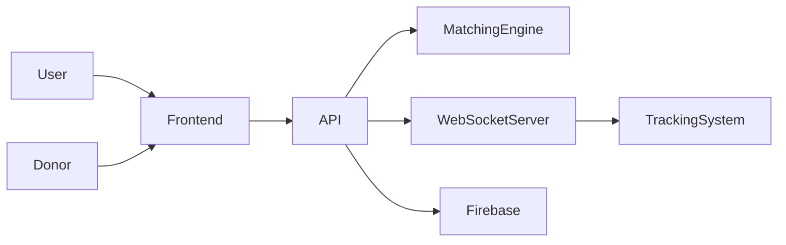

# 🩸 LifePulse AI

**AI-Powered Smart Blood Donation & Emergency Response Network**

LifePulse AI connects emergency blood requests with compatible donors and provides real-time coordination to save lives. 

## 1. PROJECT OVERVIEW

LifePulse AI is a complete platform designed to manage and fulfill emergency blood requests rapidly. Leveraging real-time matching and location-based tracking, the system identifies compatible donors within a specified radius, notifies them instantly, and allows hospitals or requesters to track incoming donors on a live map—much like ride-sharing applications. 

**Core capabilities include:**
- Emergency blood request creation
- Smart/AI donor matching based on location and compatibility
- Real-time donor status updates and coordination
- Live GPS tracking of accepted donors
- WebSocket communication for instant UI updates
- Donor simulator for testing and demonstrations
- Emergency state machine to manage request life-cycles
- Firebase Cloud Messaging (FCM) notifications
- Requester dashboard and Donor portal

## 2. KEY FEATURES

🩸 **Smart Donor Matching**: AI-driven algorithmic matching using geolocation and blood group compatibility.  
🚨 **Emergency Blood Requests**: Instant request broadcasts to eligible nearby donors.  
📍 **Real-Time Live Tracking**: Uber-style live map tracking for accepted donors heading to the donation center.  
⚡ **WebSocket-Based Updates**: Instant push updates for state changes, location data, and matches without polling.  
🚗 **GPS Simulation**: Built-in donor movement simulator for development and end-to-end testing.  
🔔 **Firebase Notifications**: Reliable push notifications to alert donors across devices.  
🧑‍⚕️ **Donor Portal**: A dedicated interface for donors to accept requests and manage their status.  
🏥 **Requester Dashboard**: Comprehensive view for hospitals to track fulfillments in real time.  
🧠 **Intelligent Escalation Engine**: Automatically expands search radius and ring sizes if a request is unmet.

## 3. SYSTEM ARCHITECTURE

## Setup & Execution

### Prerequisites
- Node.js (v16+)
- Python 3.9+
- Firebase Project with Cloud Messaging enabled

### Backend Setup
1. `cd backend`
2. `python -m venv venv`
3. Activate virtual environment (`venv\Scripts\activate` on Windows)
4. `pip install -r requirements.txt`
5. Copy `.env.example` to `.env` and fill in your secrets.
6. Obtain your `firebase-service-account.json` from Firebase Console and place it in the `backend` directory (do not commit this).
7. Run the backend: `uvicorn app.main:app --reload`

### Frontend Setup
1. `cd frontend`
2. `npm install`
3. Copy `.env.example` to `.env` and add your Firebase Web Configuration.
4. Run the frontend: `npm run dev`

> **Note:** Never commit `.env` or `firebase-service-account.json` to source control. They are ignored in the repository configuration.
